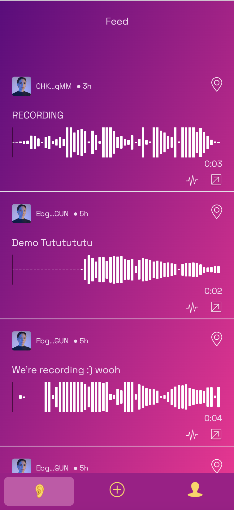
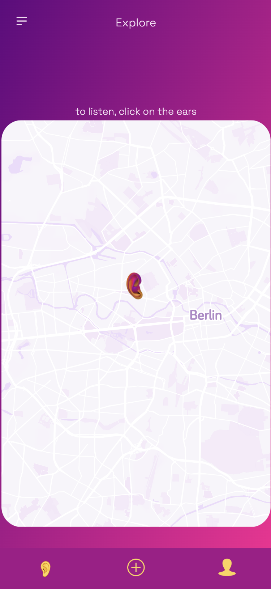
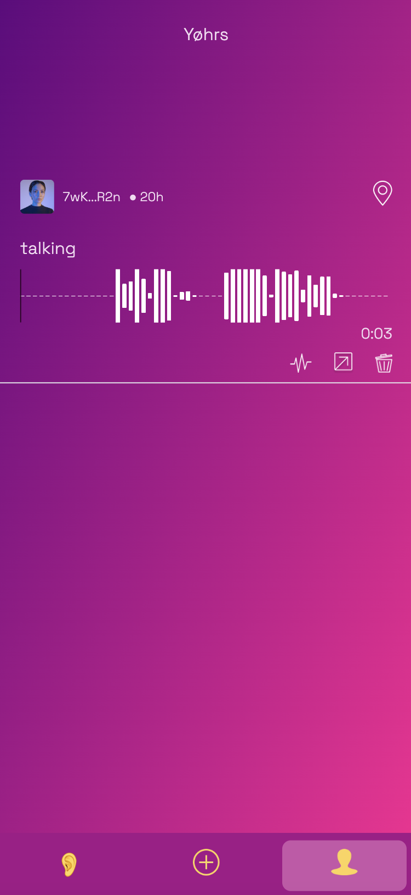
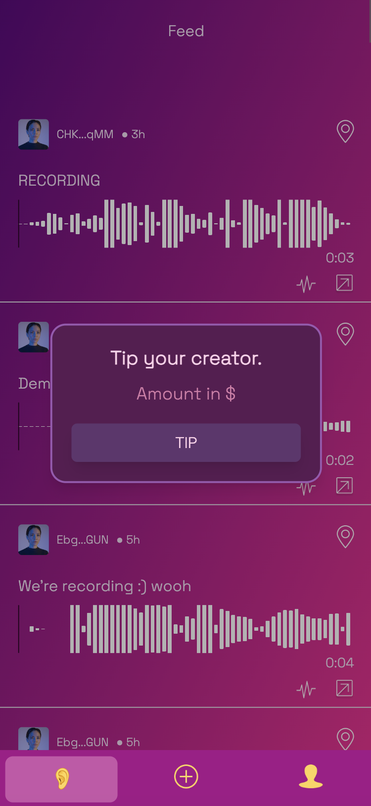
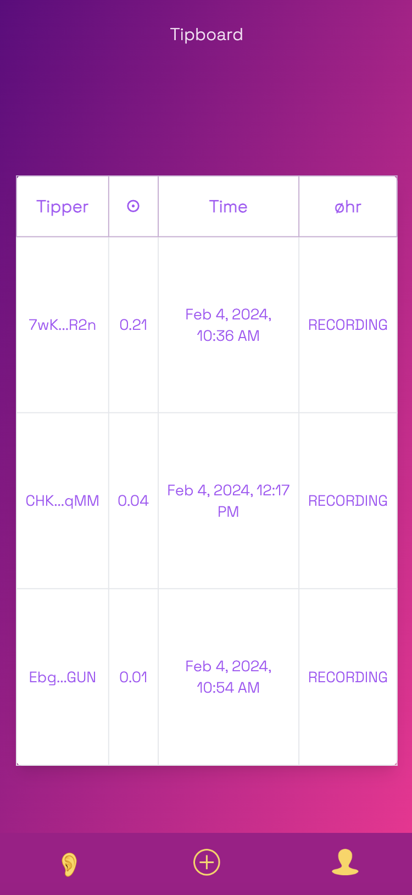

# øhr

We envision to build a decentralised social media platform that is using sound as its primary medium.
With this repo, you will be able to mint a compressed audioNFT, share and listen to other audioNFTs. 

The audioNFTs are displayed on a map that is publicly available as well as a social feed.

Users also have the ability to tip creators in SOL and see the top tippers for each creator via our Tip Leaderboard.
___
### Features

[](https://ohr-app.xyz/)

<p align="center">
    
</p>

---
[](https://ohr-app.xyz/feed)

<p align="center">
    
</p>

---
[](https://ohr-app.xyz/map)

<p align="center">
    
</p>

---
[](https://ohr-app.xyz/profile)

<p align="center">
    
</p>

---
[](https://ohr-app.xyz/)

<p align="center">
    
</p>

---
[](https://ohr-app.xyz/tipboard?owner=CHKutvbgGJeWqxbcmx5Mg7MJ6m9ykGjiyHKuYQbp2qMM)

<p align="center">
    
</p>

**Solana Program Address**: `7vZPMfghSw2rQWhvCs1XW6CDLunP36jB253bQVWWMUmu`

---

## Getting Started

*Current Tipping functionality and Leaderboard are not yet available on the mainnet*

```
npm i
npm run dev
```

## Tech

- Solana blockchain
- Underdog API - compressed NFTs
- Next.js
- Tailwind CSS
- Maplibre GL
- Anchor
- Metaplex Bubblegum
- Helius